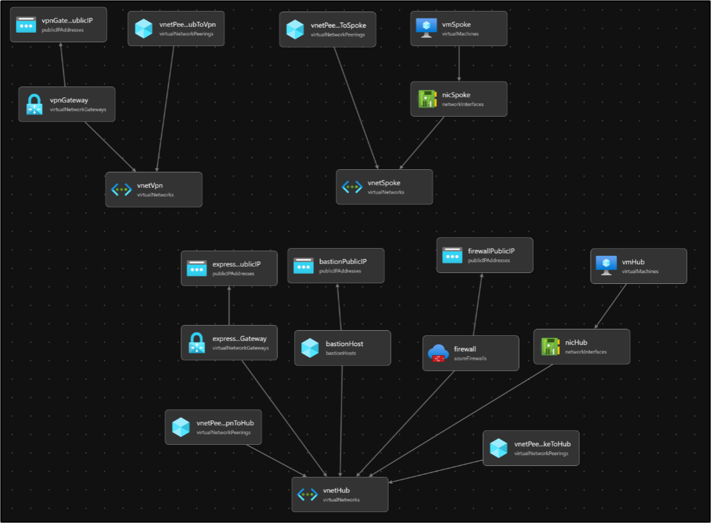

# Azure Hub & Spoke ネットワーク構成とExpressRoute Gatewayデプロイ

このBicepテンプレートは、Azure上にHub/Spoke構成のネットワーク、ExpressRoute Gateway、および仮想マシンをデプロイします。VNet PeeringによるVNet間の接続も含まれています。以下のリソースを自動的に構成します。

## 構成リソース

- **VNet-Hub**: Hub用のVirtual Network
  - メインサブネット
  - Bastionサブネット
  - Firewallサブネット
  - ExpressRoute Gatewayサブネット
- **VNet-Spoke**: Spoke用のVirtual Network
  - メインサブネット
- **VNet-VPN**: VPN用のVirtual Network
  - VPN GatewayとそのPublic IP
- **VNet Peering**: HubとSpoke、HubとVPN間のVNet Peering
- **ExpressRoute Gateway**: Hub内にExpressRoute Gatewayを配置
- **Azure Bastion**: Hub内にBastionホストを配置
- **Azure Firewall**: Hub内にFirewallを配置
- **Hub VM**: Hub内にWindows Server 2019 VMをデプロイ
- **Spoke VM**: Spoke内にWindows Server 2019 VMをデプロイ

## 構成図

以下の構成図は、このデプロイメントの全体像を示しています。

## デプロイ方法

以下のボタンをクリックして、AzureポータルからJson ファイルをコピペしてデプロイを実行してください。

## パラメータ

デプロイ時に、以下のパラメータを指定できます。

- **location**: デプロイ先のAzureリージョン（例: japaneast）
- **adminUsername**: 仮想マシンの管理者ユーザー名
- **adminPassword**: 仮想マシンの管理者パスワード（セキュアなパスワードに変更してください）

## セキュリティに関する注意

`adminPassword` は、セキュリティのために安全な値に変更することを強く推奨します。また、Azure Key Vaultを利用してパスワードを管理することも検討してください。

## 免責事項

このテンプレートはサンプルとして提供されており、実際の環境に導入する際は設定内容を十分に確認してください。

---

# Azure Hub & Spoke Network with ExpressRoute Gateway Deployment

This Bicep template deploys a Hub/Spoke network configuration, ExpressRoute Gateway, and virtual machines on Azure. It also includes VNet Peering to connect the virtual networks. The following resources are automatically configured:

## Resources

- **VNet-Hub**: Virtual Network for the Hub
  - Main subnet
  - Bastion subnet
  - Firewall subnet
  - ExpressRoute Gateway subnet
- **VNet-Spoke**: Virtual Network for the Spoke
  - Main subnet
- **VNet-VPN**: Virtual Network for VPN
  - VPN Gateway and its Public IP
- **VNet Peering**: VNet Peering between Hub and Spoke, and between Hub and VPN
- **ExpressRoute Gateway**: ExpressRoute Gateway deployed in the Hub
- **Azure Bastion**: Bastion host deployed in the Hub
- **Azure Firewall**: Firewall deployed in the Hub
- **Hub VM**: A Windows Server 2019 VM deployed in the Hub
- **Spoke VM**: A Windows Server 2019 VM deployed in the Spoke

## Architecture Diagram

The following diagram illustrates the overall architecture of this deployment.

## How to Deploy

Click the button below to deploy directly from the Azure portal using json file.

## Parameters

The following parameters can be specified during deployment:

- **location**: The Azure region where resources will be deployed (e.g., japaneast)
- **adminUsername**: The administrator username for the virtual machines
- **adminPassword**: The administrator password for the virtual machines (ensure this is a secure password)

## Security Notice

It is highly recommended to use a secure value for `adminPassword`. Consider using Azure Key Vault to manage sensitive information such as passwords.

## Disclaimer

This template is provided as a sample. Please review the configuration settings carefully before deploying it in your production environment.
